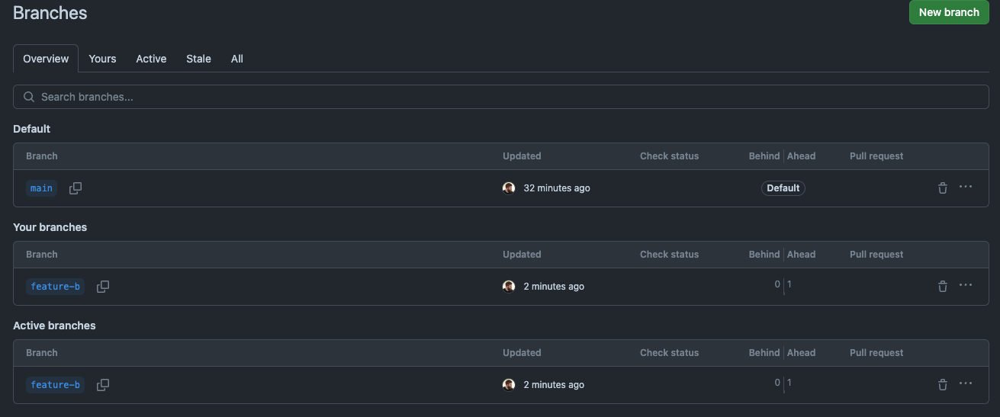

# Git

Git and GitHub are not the same thing, but they are used together.

Git: Software
    Preinstalled on macOS and Linux; Windows users need to download it (link).
    Think of Git like a memory card; it's used locally.

To check if you have Git installed, go to the terminal and enter:

```bash
git
````

We can also check the version:

``` bash
git --version
```
Example:
``` bash
(base) fredriklorensson@AirsomtFredrik2 ~ % git --version
git version 2.39.3 (Apple Git-146)
```


To start using git we first need to navigate to the right folder and:

``` bash
(base) fredriklorensson@AirsomtFredrik2 l9git % git init
Initialized empty Git repository in /Users/fredriklorensson/Documents/L9git/.git/
```

We have now created a Git repository
## Now we can save what we done:

``` bash
git add .
```

The . stage everything in the folder, and now we have to commit to the save

``` bash
(base) fredriklorensson@AirsomtFredrik2 l9git % git commit -m 'Setting up L9 and saving what we have from 20 may 2024'
```

``` bash
5 files changed, 411 insertions(+)
 create mode 100644 L9.md
 create mode 100644 VirtualBox get command.png
 create mode 100644 VirtualBox_add org check AD user and computers.png
 create mode 100644 VirtualBox_add org house.png
 create mode 100644 VirtualBox_add user.png
 ```

 We can also create files like:

``` bash
 touch app.js
 ```

 And remove 

``` bash
 rm app.js
 ```

 We can now add the new part about adding files and removing with add and commit once more:

``` bash
 git add .
 git commit -m 'Uppdate with instruction to add file and remove'
```
And we get this message
``` bash
1 file changed, 47 insertions(+)
(base) fredriklorensson@AirsomtFredrik2 l9git % 
```

So we have now save 2 times, lets check that
```bash
git log
```

```bash
1 file changed, 47 insertions(+)
(base) fredriklorensson@AirsomtFredrik2 l9git % git log
commit c3ed55c4f510fede4bc66c3f4665a2f0736a135f (HEAD -> main)
Author: Fredrik lorensson <fredriklorensson@AirsomtFredrik2.spost.nu>
Date:   Tue May 21 09:30:01 2024 +0200

    Uppdate with instruction to add file and remove

commit da11d45d37fe42a5020dc9d52c6170b93c0428ba
Author: Fredrik lorensson <fredriklorensson@AirsomtFredrik2.spost.nu>
Date:   Tue May 21 09:21:05 2024 +0200

    Setting up L9 and saving what we have from 20 may 2024
(base) fredriklorensson@AirsomtFredrik2 l9git % 
```

Tip: Add small parts and often 

There is a hash in the log we can use to move back to saves we had before. Example:


```bash
git checkout c3ed55c4f510fede4bc66c3f4665a2f0736a135f
```

Then we will be in a new branch, this can be pretty messy


## Github, gitlab

Gomepage that makes it easier for others to interact with your code and scripts, follow these steps:

1. Create a GitHub profile if you don't have one already.

2. Create a new repository (folder) by navigating to the "New" button on GitHub, then set a name for your repository and choose whether it should be private or public.

3. Add the origin by setting the remote URL to your repository. For example:
   ```bash
   git remote add origin https://github.com/yourusername/repositoryname.git


```bash
git puch -u origin main
```


### Now there might be a message
If you encounter the message "remote: Support for password authentication was removed on August 13, 2021," you'll need to use a different method for authentication. Follow these steps:

1. Go to your GitHub profile and click on "Settings."
2. Scroll down to "Developer Settings."
3. Select "Personal access tokens."
4. Set a name, expiration date, and scope for your token, then click "Generate token."
5. Copy your token and use it to update the remote URL:
   ```bash
   git remote set-url http://<token>/<username>/repo


```bash
git puch -u origin main
```

### If Error: failed to puch some refs to ''
```bash
(base) fredriklorensson@AirsomtFredrik2 l9git % git push -u origin main     

To https://github.com/florensson/solid-study-24.git
 ! [rejected]        main -> main (non-fast-forward)
error: failed to push some refs to 'https://github.com/florensson/solid-study-24.git'
hint: Updates were rejected because the tip of your current branch is behind
hint: its remote counterpart. Integrate the remote changes (e.g.
hint: 'git pull ...') before pushing again.
hint: See the 'Note about fast-forwards' in 'git push --help' for details.

To synchronize your branch with the latest changes from the remote repository, follow these steps:

1. Fetch the latest changes from the remote repository:

git fetch origin


2. Rebase your local branch onto the main branch to incorporate the latest changes:

git rebase origin/main

3. Push the changes to the remote repository:

git push -u urigin main
```

## Sometimes git can feel like...
https://www.youtube.com/watch?v=7Gr0pKI-eeg
But keep at it and google and you will learn.


# Branch
The code is now on a main branch.
Someone can now download the code and make a new branch, when they push it later we can mearge it.

The command `git checkout -b <branch-name>` is used to create a new branch and switch to it immediately. It combines the steps of creating a new branch (`git branch <branch-name>`) and checking it out (`git checkout <branch-name>`). This is useful for starting new features or working on separate tasks without affecting the main codebase. For example, `git checkout -b feature-xyz` will create a new branch named `feature-xyz` and switch to it.

## For example:

```bash
git checkout -b feature-b
```

To see the new branch: 
```bash
(base) fredriklorensson@AirsomtFredrik2 l9git % git branch
* feature-b
  main
```

```bash
  (base) fredriklorensson@AirsomtFredrik2 l9git % git branch
* feature-b
```

Added a Python file and committed changes:

```bash
git add filename.py
git commit -m "Add filename.py"
```

```bash
2 files changed, 21 insertions(+), 1 deletion(-)
 create mode 100644 hello.py
(base) fredriklorensson@AirsomtFredrik2 l9git % git log
commit 41ed09e949c7fb0b133828e15aa53fb1095dbb58 (HEAD -> feature-b)
Author: Fredrik lorensson <fredriklorensson@AirsomtFredrik2.spost.nu>
Date:   Tue May 21 13:31:01 2024 +0200
```

# Merge

We can now merge or not; it is up to us.


But we need to push the branch first:

```bash
git push origin feature-b
```

```bash
(base) fredriklorensson@AirsomtFredrik2 l9git % git push origin feature-b
Enumerating objects: 6, done.
Counting objects: 100% (6/6), done.
Delta compression using up to 8 threads
Compressing objects: 100% (3/3), done.
Writing objects: 100% (4/4), 677 bytes | 677.00 KiB/s, done.
Total 4 (delta 2), reused 0 (delta 0), pack-reused 0
remote: Resolving deltas: 100% (2/2), completed with 2 local objects.
remote: 
remote: Create a pull request for 'feature-b' on GitHub by visiting:
remote:      https://github.com/florensson/solid-study-24/pull/new/feature-b
remote: 
To https://github.com/florensson/solid-study-24.git
 * [new branch]      feature-b -> feature-b
(base) fredriklorensson@AirsomtFredrik2 l9git % 
```
Then it will look like this in github:



And we can now do the pull request


It is important to keep in sync.
- **Push**: When you have changes on your local machine.
- **Pull**: When GitHub has changes you don't have.


## Clone and fork

When deciding between cloning and forking a Git repository, it depends on your goals:

### Clone
- **Usage**: When you want to create a local copy of a repository for development or examination.
- **Command**: `git clone <repository-url>`
- **Example**: 
  ```sh
  git clone https://github.com/username/repository.git
  ```

### Fork
- **Usage**: When you want to contribute to a repository, especially in open-source projects. Forking creates your own copy on GitHub (or another hosting service), allowing you to make changes and submit pull requests.
- **Steps**:
  1. Go to the repository on GitHub.
  2. Click the "Fork" button.
  3. Clone your forked repository to your local machine:
     ```sh
     git clone https://github.com/your-username/repository.git
     ```

### Summary
- **Clone**: Use for local development when you don’t need to contribute back.
- **Fork**: Use when you plan to contribute back to the original repository.

Certainly! Here's a condensed version of the Git cheat sheet with shorter explanations:

```markdown
# Git Cheat Sheet

## Setup and Configuration

1. **Install Git:**
   - macOS: Preinstalled. Install via Homebrew: `brew install git`.
   - Linux: Preinstalled on most distributions.
   - Windows: Download from [git-scm.com](https://git-scm.com/).

2. **Configure Git:**
   - Set name: `git config --global user.name "Your Name"`.
   - Set email: `git config --global user.email "your_email@example.com"`.

## Basic Commands

- **Initialize repository:**
  ```bash
  git init
  ```

- **Clone repository:**
  ```bash
  git clone <repository_url>
  ```

- **Add files to stage:**
  ```bash
  git add <file1> <file2> ...
  ```

- **Commit changes:**
  ```bash
  git commit -m "Commit message"
  ```

- **Push changes:**
  ```bash
  git push <remote_name> <branch_name>
  ```

- **Pull changes:**
  ```bash
  git pull <remote_name> <branch_name>
  ```

## Branching and Merging

- **Create branch:**
  ```bash
  git branch <branch_name>
  ```

- **Switch branch:**
  ```bash
  git checkout <branch_name>
  ```

- **Merge branches:**
  ```bash
  git merge <branch_name>
  ```

- **Delete branch:**
  ```bash
  git branch -d <branch_name>
  ```

## Status and History

- **Check status:**
  ```bash
  git status
  ```

- **View commit history:**
  ```bash
  git log
  ```

- **Show changes between commits:**
  ```bash
  git diff <commit1> <commit2>
  ```

## Undoing Changes

- **Discard changes:**
  ```bash
  git checkout -- <file>
  ```

- **Undo staging:**
  ```bash
  git reset HEAD <file>
  ```

- **Undo last commit (keep changes):**
  ```bash
  git reset --soft HEAD^
  ```

- **Undo last commit and discard changes:**
  ```bash
  git reset --hard HEAD^
  ```

## Miscellaneous

- **View remotes:**
  ```bash
  git remote -v
  ```

- **Show Git configuration:**
  ```bash
  git config --list
  ```

- **Ignore files:**
  Create `.gitignore` and list files/directories.
```

This condensed version provides shorter explanations for each command, making it quicker to reference.